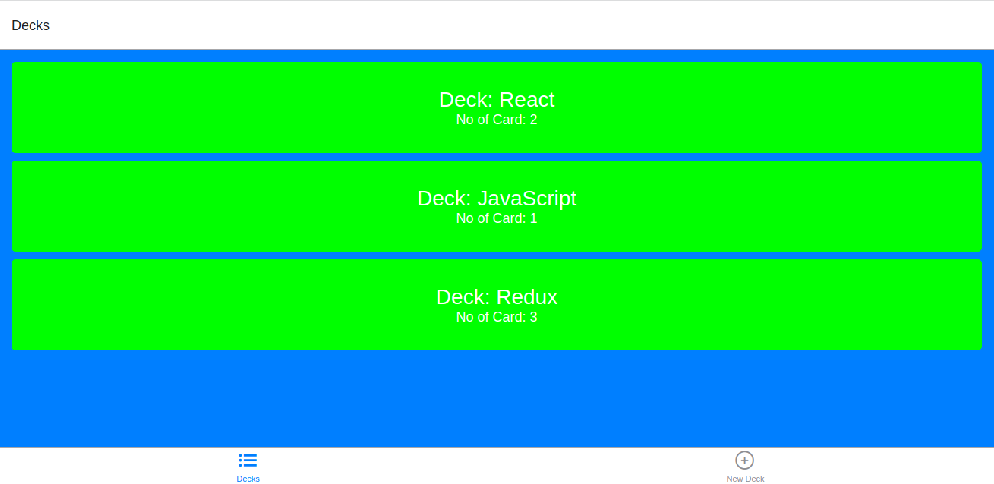
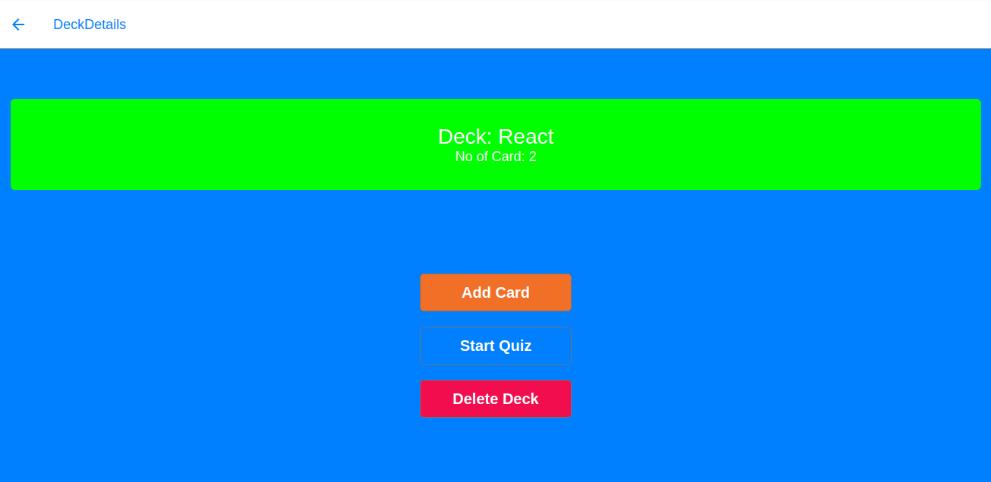
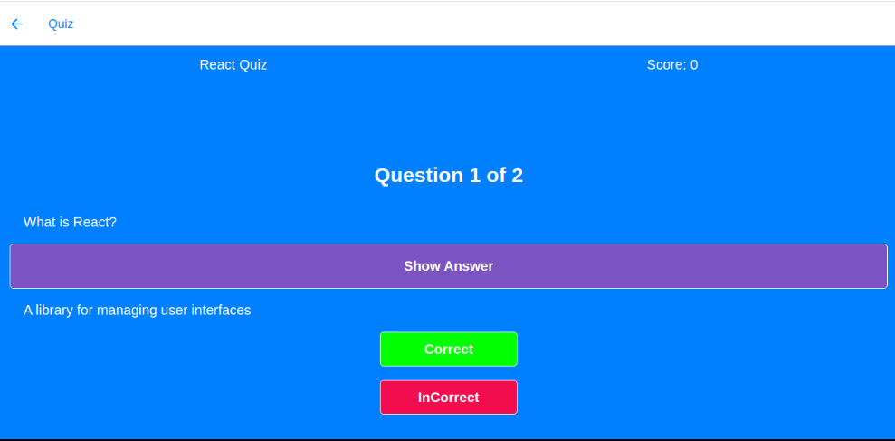
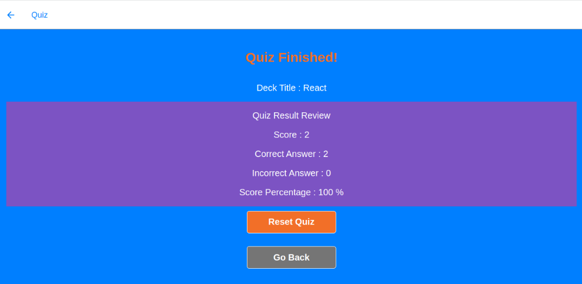

#### Mobile FlashCard for Udacity NanoDegree
### Description. 

Mobile Flashcards is an app that helps you study. For each subject or category you are studying, you create a deck. Each deck (category) will contain questions (cards) you want to asnwer. 

The app comprises of "Decks" containing "Cards". Each deck you create will contain questions (cards) for a particular category (deck). For each card you create a question and an answer. 

Once you have a deck with cards, you can start a quiz to test your knowledge. As you go through the quiz, you will mark your answers as "Correct" or "Incorrect". At the end of your quiz you will get a score. 

Happy studying!

### Instructions. 

Get the code: 
`git clone https://github.com/jkinathan/FlashCards.git`

Change directory: 
`cd FlashCards` 

Install dependencies:
`yarn install` or `npm install`

Run the app: 
`yarn start` or `npm start` or `expo start`

#### Emulators

Please ensure you have XCode or Android Studio installed and configured correctly. 

Once you have an emulator available: 

* Press `i` to open the iOS emulator *OR*
* Press `a` to open the Android emulator.

#### Emulated/Simulated Devices 

The app was tested on: 

- iOS 11+
- Android 10+.
- Ubuntu 

*Note on Android: AVDs run incredibly slowly on my machine. Sometimes it is necessary to press 'Refresh' (R,R) once Expo is running. 

### App 

To run the app on your own device, install the Expo app from either the Apple App Store or from the Google Play Store. 

Once you have the Expo app on  your device, make sure your computer (running expo) and your mobile device (where you will open expo) is on the same wifi network. Once ready, you can scan the provided QR Code and the app will open on your device. 

**Please note:** Once the app is running via `yarn start`, ensure that in your browser, on http://localhost:19002/ that you see the words "Tunnel ready" *before* scanning and opening the QR Code. 

Once you have scanned the code, your mobile device will open the app to the app home screen. 

### Screenshots

